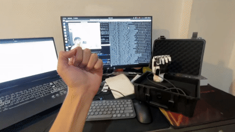

# Inspire Hand Mimic

Control an Inspire RH56DFX robotic hand from human hand gestures detected by a webcam.

The repository combines two parts:

1. A MediaPipe + TensorFlow hand-gesture recognizer.
2. A Python Modbus RTU library for the Inspire Hand.

The recognizer can run by itself for testing. The Inspire Hand package can also be used independently from Python or its command-line interface.

## Demo



[Open the full horizontal `.mp4` demo](video/inspire-hand-mimic-horizontal.mp4)

## Architecture

```text
Webcam
  │
  ▼
MediaPipe hand landmarks
  │
  ▼
Keypoint classifier (TFLite)
  │
  ├── app.py                 gesture + finger-motion demo
  ├── app-test.py            left/right gesture combination demo
  ├── GestureResolver        (left gesture, right gesture) → action
  └── MQTTPublisher           optional MQTT output
                                  │
                                  ▼
                           Application or robot bridge

Python commands / robot bridge
  │
  ▼
inspire_hand.InspireHand
  │
  ▼
ModbusClient → USB/RS-485 → Inspire RH56DFX hand

Inspire hand telemetry
  │
  ▼
UDP publisher → force_monitor / CSV recording
```

### Repository layout

```text
.
├── hand-gesture-recognition-mediapipe/  Webcam recognition and models
│   ├── app.py                            Main recognition demo
│   ├── app-test.py                       Two-hand gesture demo
│   ├── hand_tracker.py                   Reusable frame tracker
│   ├── gesture_resolver.py               Gesture-combination mapping
│   ├── mqtt_pub.py                       Optional MQTT publisher
│   └── model/                            TFLite models and training data
├── inspire_hands/                        Inspire Hand Python package
│   ├── inspire_hand/hand.py              High-level finger and gesture API
│   ├── inspire_hand/modbus.py            Modbus RTU transport
│   ├── inspire_hand/telemetry.py         UDP telemetry and CSV recording
│   └── examples/                         Hardware examples
└── video/                                 Demo media
```

## Installation

Clone the repository and its two Git submodules:

```bash
git clone --recurse-submodules https://github.com/panuza1/inspire-hand-mimic.git
cd inspire-hand-mimic
```

If the repository was cloned without submodules:

```bash
git submodule update --init --recursive
```

Create one virtual environment for the project. Python 3.10 is a practical default for the pinned TensorFlow and MediaPipe versions.

```bash
python3.10 -m venv .venv
source .venv/bin/activate
python -m pip install --upgrade pip
python -m pip install -r hand-gesture-recognition-mediapipe/requirements.txt
python -m pip install -e ./inspire_hands
```

Install MQTT support only if you use `mqtt_pub.py`:

```bash
python -m pip install paho-mqtt
```

## Run the gesture recognizer

Run commands from the recognizer directory because the demo loads model files using relative paths:

```bash
cd hand-gesture-recognition-mediapipe
python app.py
```

The webcam window recognizes open, closed, and pointing hands. Press `Esc` to quit. Useful options include:

```bash
python app.py --device 0 --width 960 --height 540
```

To test left/right hand combinations and the action resolver:

```bash
python app-test.py
```

The default gesture mapping is in [`gesture_resolver.py`](hand-gesture-recognition-mediapipe/gesture_resolver.py). Add or change entries in `GESTURE_COMBOS` to map gestures to application actions.

## Control the Inspire Hand

Connect the hand through USB/RS-485, check the serial device, and run a command:

```bash
ls -l /dev/ttyUSB*
inspire-hand --port /dev/ttyUSB0 info
inspire-hand --port /dev/ttyUSB0 open all
inspire-hand --port /dev/ttyUSB0 close all
```

Start the interactive controller with:

```bash
inspire-hand --port /dev/ttyUSB0 interactive
```

The main Python API is:

```python
from inspire_hand import InspireHand

with InspireHand(port="/dev/ttyUSB0") as hand:
    hand.open_all_fingers()
    hand.pinch(force=500)
```

Angles, speeds, and force thresholds use the controller's `0–1000` range. The package defaults to `115200` baud and Modbus slave ID `1`; change them with `--baudrate` and `--slave-id` when needed.

## Telemetry and recording

Run the controller with telemetry enabled:

```bash
inspire-hand --port /dev/ttyUSB0 \
  --telemetry --telemetry-port 8765 interactive
```

In another terminal, view the live force/angle data:

```bash
python -m inspire_hand.force_monitor --port 8765
```

Record the same stream to CSV:

```bash
python -m inspire_hand.force_monitor \
  --port 8765 --record ./recordings/grasp_001.csv
```

Only the controller process connects to the hand. The monitor receives read-only UDP telemetry.

## Training or changing gestures

The recognizer includes notebooks and CSV data for retraining:

- `keypoint_classification.ipynb` trains static hand-sign recognition.
- `point_history_classification.ipynb` trains fingertip-motion recognition.
- `model/keypoint_classifier/keypoint.csv` stores hand-sign samples.
- `model/point_history_classifier/point_history.csv` stores motion samples.

In the webcam demo, press `k` to log hand keypoints or `h` to log point history, then press `0`–`9` to select a class.

## Troubleshooting

- No webcam: try another `--device` value such as `1`.
- No serial device: check the USB cable, permissions, and `/dev/ttyUSB*`.
- Wrong hand side: keep the camera view mirrored as implemented by the demo; `app-test.py` uses MediaPipe handedness after flipping the frame.
- MQTT connection warnings: MQTT is optional; install `paho-mqtt` and start a broker before using `MQTTPublisher`.

## License

The gesture-recognition submodule includes its own Apache-2.0 license. The `inspire_hands` submodule includes its own MIT license. See the `LICENSE` files in each submodule.
